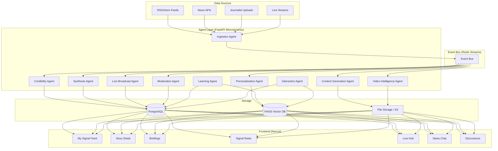
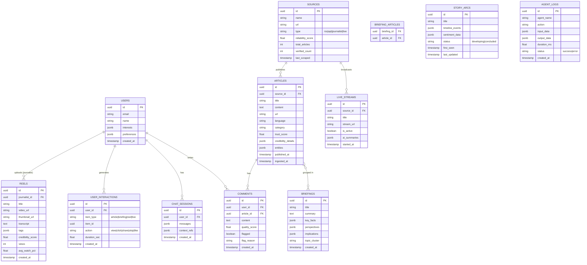
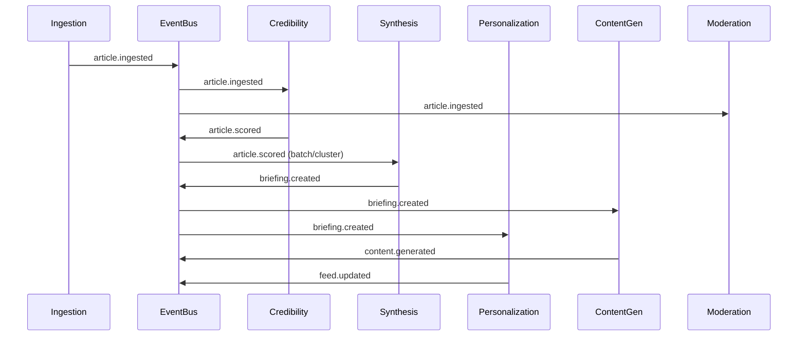

# Signal — AI-Native News Platform Implementation Plan

## Overview

Signal is an AI-native news platform that filters noise, verifies credibility, and transforms global news into personalized, interactive, multi-format intelligence. This plan covers the full system: multi-agent backend, Next.js frontend, database schemas, API structure, and deployment.

---

## System Architecture



### Key Architectural Decisions

| Decision | Choice | Rationale |
|----------|--------|-----------|
| Monorepo | Yes (`/frontend`, `/backend`, `/shared`) | Shared types, easier dev |
| Event bus | Redis Streams | Lightweight, supports consumer groups, pub/sub |
| Vector DB | FAISS (local) | No external dependency, fast for dev, swap to Pinecone later |
| LLM | OpenAI API (GPT-4o) | Best reasoning, tool-use support |
| TTS | Edge TTS / OpenAI TTS | Free tier available |
| Video | FFmpeg + canvas rendering | No external SaaS dependency |

---

## Project Structure

```
signal/
├── frontend/                    # Next.js app
│   ├── src/
│   │   ├── app/                 # App router pages
│   │   │   ├── page.tsx         # Landing / My Signal
│   │   │   ├── story/[id]/      # Story detail
│   │   │   ├── briefings/       # Smart briefings
│   │   │   ├── reels/           # Signal reels
│   │   │   ├── live/            # Live hub
│   │   │   ├── chat/            # Interactive chat
│   │   │   └── layout.tsx       # Root layout
│   │   ├── components/          # Reusable UI components
│   │   │   ├── feed/            # Feed cards, filters
│   │   │   ├── credibility/     # Trust badges, score panels
│   │   │   ├── video/           # Reel player, video cards
│   │   │   ├── chat/            # Chat interface
│   │   │   ├── live/            # Live stream viewer
│   │   │   └── common/          # Navbar, sidebar, etc.
│   │   ├── hooks/               # Custom React hooks
│   │   ├── lib/                 # API client, utilities
│   │   └── styles/              # Global CSS, design tokens
│   ├── public/                  # Static assets
│   ├── package.json
│   └── next.config.js
│
├── backend/                     # FastAPI backend
│   ├── app/
│   │   ├── main.py              # FastAPI app entry
│   │   ├── config.py            # Settings / env
│   │   ├── models/              # SQLAlchemy / Pydantic models
│   │   ├── agents/              # Multi-agent system
│   │   │   ├── base.py          # BaseAgent class
│   │   │   ├── ingestion.py     # Ingestion Agent
│   │   │   ├── credibility.py   # Credibility Agent
│   │   │   ├── synthesis.py     # Synthesis Agent
│   │   │   ├── personalization.py
│   │   │   ├── content_gen.py   # Content Generation Agent
│   │   │   ├── video_intel.py   # Video Intelligence Agent
│   │   │   ├── live_broadcast.py
│   │   │   ├── interaction.py   # Chat/Interaction Agent
│   │   │   ├── moderation.py    # Moderation Agent
│   │   │   └── learning.py      # Learning/Feedback Agent
│   │   ├── services/            # Business logic
│   │   ├── api/                 # API routes
│   │   │   ├── feed.py
│   │   │   ├── stories.py
│   │   │   ├── briefings.py
│   │   │   ├── reels.py
│   │   │   ├── live.py
│   │   │   ├── chat.py
│   │   │   ├── users.py
│   │   │   └── admin.py
│   │   ├── event_bus.py         # Redis Streams wrapper
│   │   └── vector_store.py      # FAISS wrapper
│   ├── requirements.txt
│   └── alembic/                 # DB migrations
│
└── shared/                      # Shared types/constants
    └── types.py
```

---

## Database Schema (PostgreSQL)



### Vector Store (FAISS)

| Index | Content | Dimensions | Purpose |
|-------|---------|------------|---------|
| `article_embeddings` | Article title + first 500 chars | 1536 | Semantic search, dedup, clustering |
| `user_profile_embeddings` | User interest vector | 1536 | Personalization matching |
| `briefing_embeddings` | Briefing summaries | 1536 | Related briefings |

---

## Multi-Agent Architecture — Detailed

### Base Agent Contract

```python
class BaseAgent:
    name: str
    version: str
    
    async def process(self, event: AgentEvent) -> AgentResult
    async def health_check(self) -> bool
    def log(self, action, input_data, output_data, status)
```

### Agent Specifications

| # | Agent | Input | Output | Triggers |
|---|-------|-------|--------|----------|
| 1 | **Ingestion** | RSS URLs, API keys, upload payloads | Normalized `Article` records | Cron (5 min) + webhook |
| 2 | **Credibility** | Raw article | Trust score, evidence index, reasoning | `article.ingested` event |
| 3 | **Synthesis** | Cluster of related articles | Structured `Briefing` | `articles.clustered` event |
| 4 | **Personalization** | User profile + content pool | Ranked feed items | `user.session_start` + periodic |
| 5 | **Content Gen** | Article/briefing | Summary, video script, TTS audio | `briefing.created` event |
| 6 | **Video Intel** | Uploaded reel | Tags, transcript, credibility flag | `reel.uploaded` event |
| 7 | **Live Broadcast** | Stream URL | Real-time summaries, fact-checks | Stream start event |
| 8 | **Interaction** | User chat message + context | Grounded response | User message |
| 9 | **Moderation** | Comment/content | Flagged/approved + reason | Content submission |
| 10 | **Learning** | User interactions batch | Updated model weights, profile adjustments | Hourly batch |

### Inter-Agent Event Flow



---

## API Structure

### Feed & Stories API (`/api/v1`)

```
GET    /feed                    → Personalized feed (auth required)
GET    /feed/trending           → Trending stories
GET    /stories/{id}            → Story detail + credibility panel
GET    /stories/{id}/related    → Related articles
GET    /stories/search?q=...    → Semantic search
```

### Briefings API

```
GET    /briefings               → List briefings
GET    /briefings/{id}          → Briefing detail
GET    /briefings/topic/{topic} → By topic cluster
```

### Reels API

```
GET    /reels/feed              → Personalized reel feed
GET    /reels/{id}              → Single reel
POST   /reels                   → Upload reel (journalist)
POST   /reels/{id}/interaction  → Track watch time, skip, like
```

### Live API

```
GET    /live/streams            → Active live streams
GET    /live/{id}               → Stream detail + AI summaries
WS     /live/{id}/ws            → Real-time updates
```

### Chat API

```
POST   /chat/sessions           → Create session
POST   /chat/sessions/{id}/msg  → Send message, get response
GET    /chat/sessions/{id}      → Session history
```

### Users API

```
POST   /auth/register           → Register
POST   /auth/login              → Login (JWT)
GET    /users/me                → Profile
PUT    /users/me/interests      → Update interests
GET    /users/me/interactions    → Interaction history
```

### Discussion API

```
GET    /stories/{id}/comments   → List comments
POST   /stories/{id}/comments   → Post comment
POST   /comments/{id}/react     → React to comment
```

### Admin / Metrics API

```
GET    /admin/agents/status     → Agent health
GET    /admin/agents/logs       → Agent audit logs
GET    /admin/metrics           → Platform metrics
```

---

## UI/UX Flow — Screen by Screen

### 1. Landing / Onboarding
- Hero section with Signal branding and value prop
- Interest selection grid (categories: Politics, Tech, Science, etc.)
- Quick registration → redirects to My Signal

### 2. My Signal (Personalized Feed)
- Top nav: Logo, Search bar, Notifications, Profile
- Left sidebar: Categories, Saved, Trending, Reels, Live
- Main feed: Cards with title, source, trust badge, summary snippet, time
- Right sidebar: Top Briefings, Trending Topics, Story Arcs
- Each card shows: Trust Score badge (color-coded), Source logo, Category tag

### 3. Story Detail Page
- Full article text with highlighted key facts
- **Credibility Panel** (right sidebar):
  - Trust Score gauge (0-100)
  - Evidence Index
  - Cross-source agreement visualization
  - "Why this score?" expandable reasoning
- Related articles carousel
- Discussion section below
- "Ask about this story" chat button

### 4. Smart Briefings
- Card grid of active briefings
- Each briefing card: topic, article count, last updated
- Briefing detail:
  - Executive summary
  - Key facts (bullet list)
  - Opposing perspectives (side-by-side)
  - Implications (personalized)
  - Source articles linked

### 5. Signal Reels
- Full-screen vertical scroll (Instagram Reels-style)
- Reel overlay: journalist name, topic tags, trust badge
- Side controls: Like, Share, Comment, Fact-check info
- Auto-advance + swipe navigation

### 6. Live News Hub
- Grid of active live streams (video thumbnails)
- Click → full player with:
  - AI-generated rolling summary (sidebar)
  - Fact-check overlay badges
  - Key moments timeline
- Multi-stream: Picture-in-picture mode

### 7. Interactive Chat
- Full chat interface (right panel or full page)
- Context: linked to current story or general news
- Message bubbles with source citations
- "Based on 3 verified sources" attribution

### 8. Discussion Layer
- Threaded comments below stories
- AI quality badges on comments ("High Quality", "Needs Verification")
- Misinformation flags with explanation
- Sort by: Best, Recent, Most Discussed

---

## Example User Journey

```
1. New user lands on Signal → sees hero + interest picker
2. Selects: "Technology", "Climate", "World Politics"
3. Registers with email → redirected to My Signal feed
4. Sees personalized feed with trust-scored articles
5. Clicks article about climate summit → sees story detail + credibility panel
6. Trust Score: 87/100 — clicks "Why?" → sees cross-source verification
7. Scrolls down → enters discussion, reads AI-highlighted quality comments
8. Taps "Briefing" → sees synthesized briefing with 5 sources merged
9. Swipes to Reels → watches journalist take on the summit (45s video)
10. Opens Chat → asks "What are the economic implications of this summit?"
11. Gets grounded response citing 3 articles with links
12. Returns to feed → feed has adapted based on reading behavior
```

---

## Sample Outputs

### Sample Briefing Output

```json
{
  "title": "Global Climate Summit 2026: Key Outcomes",
  "summary": "World leaders at the Geneva Climate Summit agreed to...",
  "key_facts": [
    "147 nations signed the updated carbon pledge",
    "$500B committed to green energy transition fund",
    "2035 target for net-zero adopted by 89 countries"
  ],
  "perspectives": {
    "proponents": "Environmental groups praise the binding commitments...",
    "critics": "Developing nations argue the timeline is unrealistic..."
  },
  "implications": {
    "for_you": "Based on your interest in technology, key impact areas include clean energy startups and carbon tracking platforms.",
    "global": "Supply chain restructuring expected across manufacturing sectors."
  },
  "trust_score": 91,
  "source_count": 7,
  "sources": ["Reuters", "AP News", "BBC", "Al Jazeera", "Bloomberg", "Nature", "The Guardian"]
}
```

### Sample Chat Response

```
User: What caused the banking crisis in March?

Signal: Based on 4 verified sources (Trust avg: 88/100):

The March 2026 banking instability was triggered by:
1. Rapid interest rate shifts by the Federal Reserve
2. Overexposure of mid-size banks to commercial real estate
3. A liquidity crunch following deposit outflows

Key context: Unlike 2023, regulators intervened within 48 hours,
preventing wider contagion.

Sources:
- Reuters: "Fed Emergency Meeting" (Trust: 94)
- Financial Times: "Bank Stress Analysis" (Trust: 91)
- Bloomberg: "Deposit Flight Data" (Trust: 87)
- AP: "Regulatory Response Timeline" (Trust: 82)
```

---

## Deployment Strategy

### Development (Phase 1 — What we build now)

| Component | Hosting | Notes |
|-----------|---------|-------|
| Frontend (Next.js) | `localhost:3000` | Dev server |
| Backend (FastAPI) | `localhost:8000` | Uvicorn |
| PostgreSQL | Local / Docker | Dev database |
| FAISS | In-process | Python library |
| Redis | Docker | Event bus |

### Production (Future)

| Component | Service | Notes |
|-----------|---------|-------|
| Frontend | Vercel | Edge deployment |
| Backend | AWS ECS / Railway | Container-based |
| PostgreSQL | Supabase / RDS | Managed |
| Vector DB | Pinecone | Managed, scalable |
| Redis | Upstash / ElastiCache | Managed |
| Media | S3 + CloudFront | CDN for videos |
| CI/CD | GitHub Actions | Auto-deploy on merge |

---

## Verification Plan

### Automated Tests

Since this is a greenfield project, we'll verify incrementally:

1. **Backend agents**: Unit tests with `pytest` — run with:
   ```
   cd backend && python -m pytest tests/ -v
   ```
2. **API endpoints**: Integration tests via `httpx` test client — same command
3. **Frontend**: Run dev server and verify each screen loads:
   ```
   cd frontend && npm run dev
   ```

### Browser Verification

After each phase, use browser subagent to:
- Navigate to each page and verify it renders correctly
- Check that components are interactive (clicks, navigation)
- Verify API integration (mock data appears in feed)

### Manual Verification

- **Feed renders**: Navigate to `localhost:3000` → see personalized feed cards
- **Story detail**: Click a card → see full article + credibility panel
- **Briefings**: Navigate to `/briefings` → see synthesized content
- **Reels**: Navigate to `/reels` → see scrollable video feed
- **Chat**: Navigate to `/chat` → type a question → get grounded response
- **Live Hub**: Navigate to `/live` → see stream grid

> [!IMPORTANT]
> **User input requested**: Since this project involves LLM API calls (OpenAI), should we:
> 1. Use **mock/demo data** for initial build (no API key needed), then swap in real APIs later?
> 2. Require an **OpenAI API key** from the start?
>
> Recommendation: Start with rich mock data to build the full UI + agent scaffold, then wire real APIs.

---

## Implementation Order

We will build in this order to ensure each phase is demonstrable:

1. **Foundation**: Project init, design system, DB schema
2. **Backend scaffold**: FastAPI + agent base classes + event bus + mock data seeding
3. **Frontend core**: My Signal feed, Story Detail, Briefings (consuming mock APIs)
4. **Agent wiring**: Real agent logic with LLM calls (Credibility, Synthesis, Personalization)
5. **Video/Reels/Live**: Media pipeline + Reels UI + Live Hub
6. **Chat + Discussion**: Interactive chat + comments + moderation
7. **Story Arcs + Advanced**: Timeline tracker, multi-language
8. **Polish**: Animations, responsive design, performance
